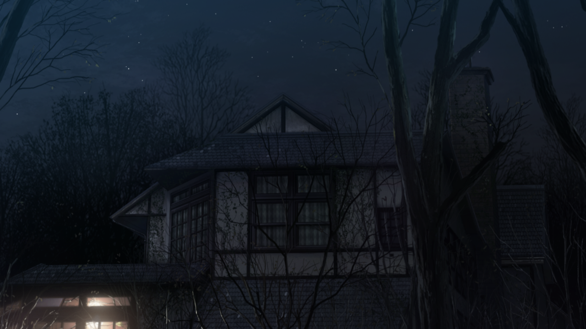

# hexo-pluskid-theme
A hexo theme that follow the style of pluskid's blog

# Introduction

Demo: http://www.neutronest.moe/about

A hexo theme based on pluskid's blog: http://freemind.pluskid.org/ , Thanks pluskid a lot!

However, this theme has been modified for my own taste, for example, using many images and words in 魔法使いの夜(Mahoutsukai no Yoru).




# Usage

1. In the `themes/` directory:

```
git clone https://github.com/neutronest/hexo-pluskid-theme.git
```
2. Change the `theme` property in `config.yml` file

```
theme: hexo-pluskid-theme
```

3. Run: `hexo server`

4. Hope you will not fail (x


# Licence.

MIT Licence.
